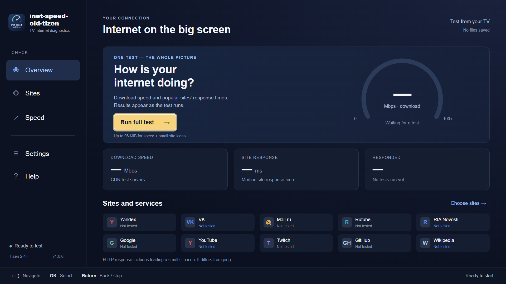
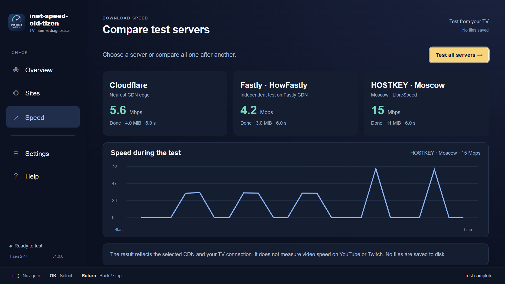

# inet-speed-old-tizen

[English](README.md)

Приложение для ручной проверки интернета с пульта Samsung Smart TV: отклик сайтов и скорость загрузки с тестовых CDN. Интерфейс по умолчанию на английском, с иконкой для Smart Hub. В **Settings → Language** через OK можно переключить язык на русский и обратно; выбор сохраняется между запусками. Переключается весь интерфейс, включая результаты, подсказки и ошибки.

Проверено на **Samsung UE50KU6000 (серия KU6000), Tizen 2.4.0, прошивка T-JZL6DEUC-1260.1**. На этом телевизоре проверены установка, запуск и навигация с пульта. Автоматические проверки движка и интерфейса используют синтетические ответы. Код написан на ES5, без внешних библиотек времени выполнения и современных CSS Grid/переменных. [Samsung указывает WebKit r152340 для Tizen 2.4](https://developer.samsung.com/smarttv/develop/specifications/web-engine-specifications.html).

## Скриншоты

Примеры интерфейса; показанные значения измерений иллюстративные.




## Скачивание и установка

Скачайте ZIP из [Releases](https://github.com/numbereleven-a/inet-speed-old-tizen/releases/latest) и извлеките WGT. Публичный пакет не подписан: перед установкой подпишите его своим профилем сертификата Samsung, содержащим DUID вашего телевизора. Включите Developer Mode и подключите телевизор к Tizen Studio. См. инструкции Samsung по [сертификатам](https://developer.samsung.com/smarttv/develop/getting-started/setting-up-sdk/creating-certificates.html) и [подключению ТВ](https://developer.samsung.com/smarttv/develop/getting-started/using-sdk/tv-device.html). Также можно собрать и подписать исходники командами ниже.

## Проверки

- **Полная проверка:** десять сайтов, затем три сервера скорости по очереди.
- **Сайты:** все, группа, своя подборка или один сайт. Сайты вне текущей группы затемняются, но остаются доступными для выбора. Яндекс, VK, Mail.ru, Rutube, РИА Новости, Google, YouTube, Twitch, GitHub и Wikipedia.
- **Скорость:** Cloudflare, независимый HowFastly на платформе Fastly и HOSTKEY (Москва). Можно проверить один сервер или все три. Расположение узла CDN зависит от маршрута сети.
- **Сайт вручную:** откройте **Сайты → Сайт вручную → Ввести адрес**, чтобы вызвать клавиатуру телевизора. Введите домен или HTTP/HTTPS-адрес и выберите **Проверить сайт**. По умолчанию используется HTTPS. Проверяется `/favicon.ico` с домена; путь, параметры и фрагмент введённого URL игнорируются. Адрес хранится только до закрытия приложения. Отсутствие иконки может вызвать ошибку пробы, даже если сайт работает.
- **Настройки:** таймаут 2/3/5 секунд, 3/5 проб на сайт, тест скорости 6/10/15 секунд, лимит 8/32/64 МиБ на сервер. По умолчанию: 3 секунды, 3 пробы, 10 секунд, 32 МиБ.
- **Информация:** снимок модели ТВ, версии Tizen и прошивки, разрешения, языка системы, загрузки CPU, подключения, имени/сигнала/защиты Wi-Fi, локального IP, маски, шлюза, DNS, оперативной памяти и накопителей. Кнопка **Обновить** перечитывает данные; кнопка накопителя переключает доступные устройства. Ожидание ограничено тремя секундами и прекращается при выходе с экрана. Неподдерживаемые данные отмечены как **Недоступно**. RAM относится ко всей системе, накопитель указан без системного резерва. API Tizen 2.4 не раскрывают стандарт и частоту Wi-Fi. Сведения об устройстве и сети не сохраняются и не передаются.
- Ошибка прекращает дальнейшие пробы этого адреса и включает паузу 30 секунд. Следующие адреса продолжают проверяться. Во время паузы новые запуски пропускают адрес; автоматических повторов нет.

Стрелки перемещают фокус, OK выбирает. OK на сайте открывает отдельный запуск и добавление в свою группу. Return во время проверки останавливает запросы. При вводе адреса стрелки и Backspace редактируют текст, а «Готово» закрывает клавиатуру. Из ручной проверки Return возвращает к сайтам; на других экранах возвращает в обзор, из обзора открывает подтверждение выхода. При уходе приложения в фон проверка останавливается.

## Что именно измеряется

Отклик сайта — время загрузки маленькой иконки с указанного домена через HTTPS. Для Rutube используется его домен статики `static.rtbcdn.ru`, указанный в карточке. Из успешных проб рассчитывается медиана. Первая проба может включать DNS, TCP и TLS; последующие могут использовать существующее соединение. Разброс — средняя абсолютная разница соседних успешных проб. Это **не ICMP ping**, не процент потери пакетов и не проверка видео или входа в аккаунт. Перенаправление или CDN сайта также может влиять на результат.

Ошибка загрузки иконки не доказывает недоступность всего сайта: возможны таймаут, TLS/сертификаты старого ТВ, защита сайта, изменившийся тестовый ресурс. Приложение не объявляет это доказательством блокировки.

Скорость — число полученных байтов / время от запуска запросов, включая установку соединения и паузы. Два запроса выполняются одновременно, порциями до 1 МиБ каждый. Cloudflare и Fastly начинают с 256 КиБ; HOSTKEY использует ответы LibreSpeed фиксированного размера 1 МиБ. Каждый ответ имеет конечный размер; данные освобождаются после запроса. При достижении времени, лимита трафика, ошибке или остановке активные запросы прерываются. Лимит — размер запрошенных тел данных; HTTPS/HTTP-заголовки и прочие сетевые накладные расходы добавляют небольшой трафик сверх него. Память всего WebKit больше суммарного размера двух тел. Замер короче 0,5 секунды не считается готовым результатом.

График показывает скорость за каждый интервал измерения; итоговый результат — средняя скорость за весь тест.

Файлы, содержимое ответов, адрес IP и история результатов не сохраняются приложением. В localStorage хранятся только настройки и ID выбранных сайтов. Результаты живут до закрытия приложения. Небольшой лимит трафика сокращает замер на быстрой сети. Скорость зависит от Wi-Fi/Ethernet телевизора, сервера, маршрута и накладных расходов небольших запросов; это оценка загрузки с выбранного CDN, а не гарантированная скорость тарифа. Upload в этой версии не измеряется.

Серверы скорости должны разрешать CORS. Используются конечные ответы `application/octet-stream` с проверкой размера: [Cloudflare Speedtest API](https://github.com/cloudflare/speedtest), [HowFastly](https://speed.edgecompute.app/) и [тест HOSTKEY](https://speedtest.hostkey.ru/). Сайты проверяются без CORS через Image. Прокси и отдельный сервер для приложения не требуются.

## Проверка и сборка

Для разработки нужны Node.js и Tizen Studio с Samsung TV Extension. Из корня проекта:

```text
npm ci
npm run check
npm test
```

Сценарий интерфейса с синтетическими ответами запускается через `npm run test:ui`. Он требует браузер Chromium, установленный Playwright, или путь к своему Chromium-браузеру в переменной `BROWSER_EXECUTABLE`.

Проверка синтаксиса требует ES5 для всего кода приложения. Тесты используют синтетические HTTP-ответы и таймеры: таймауты, прекращение повторов, отмена, лимит трафика, освобождение запросов и отклонение неверных данных.

Сборка с Tizen CLI (из PowerShell):

```powershell
./scripts/package.ps1 -TizenCli tizen
```

Результат: `artifacts/<версия>/inet-speed-old-tizen-<версия>-resign-required.wgt`. **Этот WGT не подписан и напрямую на телевизор не устанавливается.** Предыдущие версии сохраняются; готовый пакет той же версии не перезаписывается.

Для подписанного пакета передайте имя своего профиля сертификата:

```powershell
./scripts/package.ps1 -TizenCli tizen -CertificateProfile YOUR_CERTIFICATE_PROFILE
```

Включите Developer Mode, подключите ТВ к Tizen Studio, создайте профиль Samsung с DUID телевизора, импортируйте WGT или исходники и подпишите пакет для этого устройства. См. инструкции Samsung по [сертификатам](https://developer.samsung.com/smarttv/develop/getting-started/setting-up-sdk/creating-certificates.html), [подключению ТВ](https://developer.samsung.com/smarttv/develop/getting-started/using-sdk/tv-device.html) и [импорту приложения](https://developer.samsung.com/smarttv/develop/getting-started/creating-tv-applications/importing-tv-applications.html). Приложение имеет собственный package ID и устанавливается отдельно от Twitch.

## Лицензия

[MIT](LICENSE).
